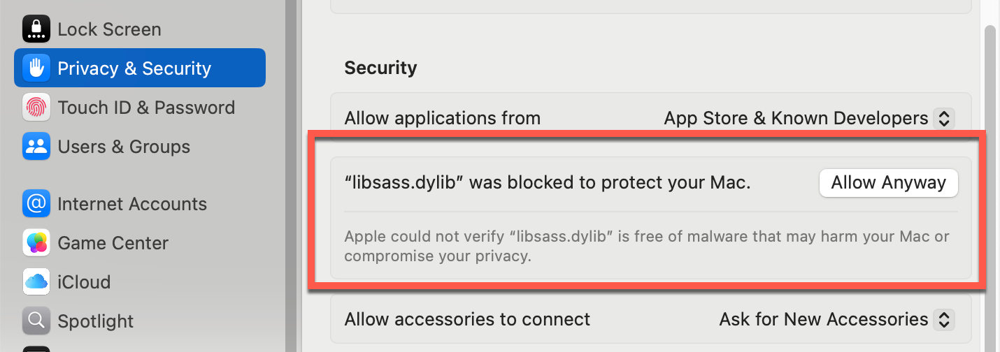

# DDD Seoul 웹사이트

DDD Seoul 웹사이트는 .NET 기반의 [Statiq](https://www.statiq.dev/) 정적 웹사이트 생성도구를 이용해서 만들었으며, [https://dddseoul.kr](https://dddseoul.kr)에서 확인할 수 있습니다.

## 사전 요구사항

- [.NET SDK 8+](https://dotnet.microsoft.com/download/dotnet/8.0)
- [Visual Studio 2022](https://visualstudio.microsoft.com/vs/) 또는 [Visual Studio Code](https://code.visualstudio.com/) + [C# DevKit](https://marketplace.visualstudio.com/items?itemName=ms-dotnettools.csdevkit)
- 윈도우 사용자: [PowerShell 7+](https://learn.microsoft.com/powershell/scripting/install/installing-powershell)

## 시작하기

1. 저장소를 자신의 로컬 컴퓨터로 클론합니다.

    ```bash
    git clone https://github.com/dddseoul/dddseoul.github.io.git
    ```

1. 저장소 디렉토리로 이동합니다.

    ```bash
    cd dddseoul.github.io
    ```

1. 프로젝트를 빌드하고 실행합니다.

    ```bash
    dotnet restore && dotnet build && dotnet run --project ./src/DDDSeoul -- preview
    ```

1. 웹 브라우저에서 [http://localhost:5080](http://localhost:5080)으로 접속한 후 웹사이트를 확인합니다.

1. 배포를 위해 아티팩트를 생성하려면 아래 명령어를 실행합니다.

    ```bash
    dotnet run --project ./src/DDDSeoul -- deploy
    ```

### Mac OS 트러블슈팅

MacOS(실리콘 맥)에서 실행시 아래와 같은 에러메시지가 발생할 수 있습니다.

```bash
Unable to load shared library 'libsass' or one of its dependencies
```

이는 `libsass.dylib` 파일이 없어서 발생하는 문제입니다. 아래 명령어를 실행하여 해결할 수 있습니다.

```bash
sudo mkdir -p /usr/local/lib/ && sudo cp ./lib/libsass.dylib "$_"
```

> `lib` 디렉토리에 있는 `libsass.dylib` 파일은 실리콘 맥OS 용으로 새롭게 빌드한 파일입니다.

이후, 다시 `dotnet run --project ./src/DDDSeoul -- preview` 명령어를 실행하면 정상적으로 실행됩니다. 이 때 보안 경고가 발생할 수 있습니다. 이 경우, `시스템 환경설정` > `보안 및 개인 정보 보호` > `보안` 메뉴에서 `libsass.dylib` 파일을 열 수 있도록 허용해주세요.



좀 더 자세한 내용은 [https://github.com/Taritsyn/LibSassHost](https://github.com/Taritsyn/LibSassHost?tab=readme-ov-file#installation)를 참고하세요.

## 컨텐츠 수정하기

- 컨텐츠는 `src/DDDSeoul/input` 디렉토리에 위치합니다. `index.md` 파일을 수정하면 웹사이트의 첫 페이지를 수정할 수 있습니다.
- `src/DDDSeoul/input` 디렉토리에 새로운 Markdown 파일을 추가하면 새로운 페이지를 만들 수 있습니다.

## 이메일 템플릿 생성/수정하기

이메일 템플릿은 `templates` 디렉토리에 마크다운 문서 형태로 관리합니다. 템플릿을 생성 또는 수정한 후 아래 명령어를 실행시켜 HTML 파일로 변환해야 합니다.

```bash
# zsh/bash
./scripts/md2html.sh

# PowerShell
./scripts/md2html.ps1
```

## 웹사이트에 문제가 있나요?

문제가 있거나 개선할 점이 있다면 [이슈](../../issues)를 등록해주세요.
