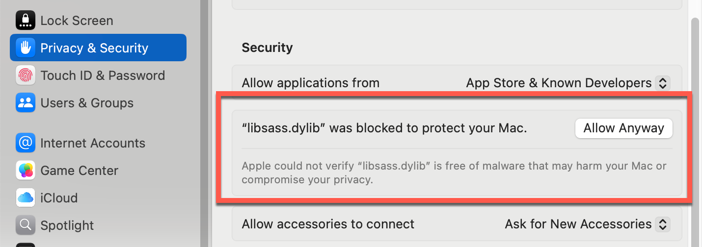

# DDD Seoul 웹사이트

DDD Seoul 웹사이트는 .NET 기반의 [Statiq](https://www.statiq.dev/) 정적 웹사이트 생성도구를 이용해서 만들었으며, [https://dddseoul.kr](https://dddseoul.kr)에서 확인할 수 있습니다.

## 사전 요구사항

- [.NET SDK 9+](https://dotnet.microsoft.com/download/dotnet/9.0)
- [Visual Studio 2022](https://visualstudio.microsoft.com/vs/) 또는 [Visual Studio Code](https://code.visualstudio.com/) + [C# DevKit](https://marketplace.visualstudio.com/items?itemName=ms-dotnettools.csdevkit)
- 윈도우 사용자: [PowerShell 7+](https://learn.microsoft.com/powershell/scripting/install/installing-powershell)

## 시작하기

1. 저장소를 자신의 로컬 컴퓨터로 클론합니다.

    ```bash
    git clone https://github.com/dddseoul/dddseoul.github.io.git
    ```

1. 저장소 디렉토리로 이동합니다.

    ```bash
    cd dddseoul.github.io
    ```

1. 프로젝트를 빌드하고 실행합니다.

    ```bash
    dotnet restore && dotnet build && dotnet run --project ./src/DDDSeoul -- preview
    ```

1. 웹 브라우저에서 [http://localhost:5080](http://localhost:5080)으로 접속한 후 웹사이트를 확인합니다.

1. 배포를 위해 아티팩트를 생성하려면 아래 명령어를 실행합니다.

    ```bash
    dotnet run --project ./src/DDDSeoul -- deploy
    ```

### Mac OS 트러블슈팅

MacOS(실리콘 맥)에서 실행시 아래와 같은 에러메시지가 발생할 수 있습니다.

```bash
Unable to load shared library 'libsass' or one of its dependencies
```

이는 `libsass.dylib` 파일이 없어서 발생하는 문제입니다. 아래 명령어를 실행하여 해결할 수 있습니다.

```bash
sudo mkdir -p /usr/local/lib/ && sudo cp ./lib/libsass.dylib "$_"
```

> `lib` 디렉토리에 있는 `libsass.dylib` 파일은 실리콘 맥OS 용으로 새롭게 빌드한 파일입니다.

이후, 다시 `dotnet run --project ./src/DDDSeoul -- preview` 명령어를 실행하면 정상적으로 실행됩니다. 이 때 보안 경고가 발생할 수 있습니다. 이 경우, `시스템 환경설정` > `보안 및 개인 정보 보호` > `보안` 메뉴에서 `libsass.dylib` 파일을 열 수 있도록 허용해주세요.



좀 더 자세한 내용은 [https://github.com/Taritsyn/LibSassHost](https://github.com/Taritsyn/LibSassHost?tab=readme-ov-file#installation)를 참고하세요.

## 컨텐츠 수정하기

- 컨텐츠는 `src/DDDSeoul/input` 디렉토리에 위치합니다. `index.md` 파일을 수정하면 웹사이트의 첫 페이지를 수정할 수 있습니다.
- `src/DDDSeoul/input` 디렉토리에 새로운 Markdown 파일을 추가하면 새로운 페이지를 만들 수 있습니다.
- 2026 메인 페이지와 `/coc`, `/privacy`, `/sponsorship`은 `Layout: /_layout-2026.cshtml` 설정으로 전용 레이아웃을 사용합니다. 안내 문서는 `IsInfoPage: true`를 추가하면 페이지 제목과 본문 영역이 표시됩니다. 탐색 메뉴는 `theme/input/_navigation-2026.cshtml`, 스타일과 동작은 각각 `theme/input/scss/home-2026.scss`, `theme/input/js/home-2026.js`에서 수정합니다.
- 2024·2025 페이지는 각 연도 폴더의 `_directory.yml`에서 기존 `_layout.cshtml`과 `ArchiveRoot`를 지정합니다. 이전 행사에서 여는 안내 문서는 `/2024/coc`, `/2025/privacy`처럼 해당 연도 경로로 연결되며, 새로고침하거나 직접 접속해도 기존 내용과 `clean-blog.scss` 스타일을 유지합니다. 해당 연도에 없는 발표제안·참가신청 메뉴는 `ShowCfpInNavbar`, `ShowRegisterInNavbar`로 숨길 수 있습니다. 2026 디자인을 수정할 때는 이전 행사의 공통 스타일을 수정하지 마세요.
- 2026 페이지의 기본 글자 크기는 `home-2026.scss`의 `--ddd-font-base`로 관리합니다. PC는 `112.5%`, 760px 이하 화면은 `100%`로, 브라우저 기본값이 16px일 때 각각 18px·16px입니다. 본문은 `1rem`, 메뉴·버튼·표는 `.875rem`, 보조 문구는 `.75rem`을 사용하므로 기본값을 바꾸면 함께 조정됩니다. 브라우저의 기본 글자 크기 설정도 반영됩니다.
- `/sponsorship`의 후원 종류는 PC에서 비교표로, 760px 이하에서는 등급별 카드로 표시하며 가로 스크롤 없이 읽을 수 있습니다. 480px 이하에서는 카드를 한 열로 배치합니다. 후원 등급·금액·혜택은 `theme/input/_sponsorship-tiers.cshtml`에서 한 번만 정의하고 표와 카드를 함께 생성하므로 JavaScript 없이도 작동합니다. `input/sponsorship.cshtml`은 Markdown 쇼트코드로 본문을 작성하고 이 부분 템플릿을 불러옵니다. 반응형 스타일은 `home-2026.scss`의 `.sponsorship-table`, `.sponsorship-cards`, `.sponsorship-card` 규칙에서 관리합니다.
- 영어 페이지는 후원 안내에 한해 `/en/sponsorship`으로 제공합니다. 본문은 `input/en/sponsorship.cshtml`에서 관리하며, 한국어와 영어 본문·통계·차트 범례·이미지 대체 설명은 함께 갱신하세요. 두 페이지는 같은 후원 템플릿과 차트 이미지를 재사용합니다. 후원 금액은 원화 정수로 한 번만 정의하고 한국어는 만원 단위, 영어는 `KRW` 금액으로 표시합니다. `Language: en`은 해당 페이지의 메뉴·푸터·접근성 문구를 영어로 표시하며, 지정하지 않은 페이지는 한국어를 유지합니다. 두 후원 페이지의 `Canonical`은 각각의 절대 URL이고, `AlternateLanguageUrl`은 상대 언어 페이지의 루트 경로입니다. 이 메타데이터로 `한국어 | English` 전환 링크와 상호 `hreflang`을 생성합니다. 다른 페이지는 번역하지 않으므로 영어 페이지에서도 메뉴·푸터 링크는 기존 한국어 경로로 연결합니다.
- `/sponsorship`은 후원 종류·혜택을 먼저 보여주고, 2025년 상세 실적은 파이 차트와 범례로 표시합니다. 차트 원본은 `theme/input/images/sponsorship/2025-attendance.svg`, `2025-experience.svg`, `2025-roles.svg`이며, `input/sponsorship.cshtml`에서 이미지로 불러옵니다. SVG는 색상·글꼴 설정을 자체 포함하므로 별도로 열어도 표시됩니다. 통계를 수정할 때는 SVG 주석의 원자료 수를 기준으로 조각의 각도와 번호 위치를 다시 계산하고, 페이지의 요약·범례·이미지 대체 설명과 SVG의 제목·설명도 함께 갱신하세요. 반올림한 비율 대신 원자료로 각도를 계산하며, 판단 불가 응답도 전체에 포함합니다. 페이지 배치와 범례 색상은 `home-2026.scss`의 `.sponsorship-pie` 및 `.pie-color-*` 규칙에서 관리합니다. 색상을 바꿀 때는 SVG의 조각 색상도 맞춰 주세요. 760px 이하 화면에서는 차트와 범례를 세로로 배치합니다.

## 이메일 템플릿 생성/수정하기

> **NOTE**: 이메일 템플릿을 생성/수정하기 위해서는 [Azure Functions Core Tools](https://learn.microsoft.com/azure/azure-functions/functions-run-local)를 설치해야 합니다.

이메일 템플릿은 `templates` 디렉토리에 마크다운 문서 형태로 관리합니다. 템플릿을 생성 또는 수정한 후 아래 명령어를 실행시켜 HTML 파일로 변환해야 합니다.

```bash
# zsh/bash
./scripts/md2html.sh

# PowerShell
./scripts/md2html.ps1
```

## 웹사이트에 문제가 있나요?

문제가 있거나 개선할 점이 있다면 [이슈](../../issues)를 등록해주세요.
